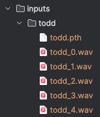

# Voice Clone with Tortoise

Cloning my voice with Tortoise-TTS on Apple Silicon (Mac M1/M2 compatible, CPU-only)

---

## 🎙️ Voice Recording Script

Record at least 3–4 WAV files using the lines below. Each recording should be 10–20 seconds long, clean, and in a quiet space.

Save them as:

- `inputs/<CUSTOM_VOICE>/sample1.wav`
- `inputs/<CUSTOM_VOICE>/sample2.wav`
- ...

### 🎧 Recording One - Conversational
Hey there, I’m Todd. I live in a small lake community, love being outdoors, and I’m usually chasing my kids around their sports events. My job? I build tech that actually works — no fluff, just solid architecture. Most days I’m deep in cloud or AI, but right now, I’m cloning my voice for a little fun and a lot of future automation. I’m speaking casually here, like I would if we were sitting at a fire pit just catching up. This tone — this is me relaxed, low-key, no pressure, just real talk with a little bit of a smile.

### 🎧 Recording Two - Professional/Confident
Let’s talk business. When I walk into a room, I bring leadership, strategy, and execution. My philosophy is simple: the more I help others succeed, the more I succeed. I’ve built teams from the ground up, transformed legacy systems into serverless platforms, and led architecture for Fortune 100 companies. I believe in clarity, in moving fast, and in being direct. This voice? It’s the one I use when I’m presenting to executives or aligning teams across engineering, data, and delivery. Assertive, calm, and crystal clear.

### 🎧 Recording Three - Expressive
Can you believe how fast things are changing? I mean, we went from static websites to AI that writes code and voices in real time — it’s wild. Sometimes I stop and think about how far we’ve come, and it honestly blows my mind. The energy in this space is electric. There’s excitement, sure — but also a bit of anxiety. Are we doing this right? Are we building responsibly? That’s why I love this work — it’s human. It’s messy. It’s full of big wins and hard lessons. And that rollercoaster? I’m all in for the ride.

### 🎧 Recording Four - Technical
In a typical architecture, we decouple the frontend via S3 and CloudFront, API Gateway handles routing, and Lambda processes business logic. Behind that, DynamoDB stores state, and all services are secured via IAM roles scoped to the minimum permissions necessary. When running on Kubernetes, I prefer Helm for templating, ArgoCD for deployment, and use EFS for persistent workloads when needed. That’s not just jargon — it’s how we deliver scalable, cost-effective platforms. The key is speaking clearly — even with complex technical content.

### 🎧 Recording Five - Storytelling
So there I am — middle of the night, production’s on fire, and the logs are silent. Classic. Turns out, someone pushed a change that broke our entire event pipeline. I’m on a Zoom call, screensharing with four teams, and I say, “Look, we’re not guessing. We’re going to trace this with Datadog and find the root cause.” Twenty minutes later, we spot it — cold-start latency from a misconfigured Lambda. Fixed it, postmortem documented, and I got two hours of sleep. Not glamorous, but that’s the job — and honestly, I live for this stuff.

---

## 🐳 Docker Instructions

### 1. Build the Docker Image

```bash
docker build -t tortoise .
```

### 2. Folder Structure (Host Side)

```bash
.
├── Dockerfile
├── inputs/
│   └── <CUSTOM_VOICE>/
│       ├── sample1.wav
│       └── sample2.wav
├── output/
```



### 3. Run the Container Non-Interactively with Mounted Folders

Set environment variables for your custom voice folder and the text you want to synthesize.

```bash
docker run --rm -v $(pwd)/inputs:/app/tortoise_app/tortoise/voices \
  -v $(pwd)/output:/app/outputs \
  -e TEXT="This is my real voice." \
  -e VOICE="<CUSTOM_VOICE>" \
  tortoise
```

This mounts:
- `inputs/` → inside the container as `/app/tortoise_app/tortoise/voices`
- So `inputs/todd/` becomes available as the `todd` voice
- `output/` → receives the generated `.wav` files from the TTS process

The container runs, generates the audio file, and exits cleanly.

### 4. Example Output

```bash
Generating speech for voice: todd
Generating autoregressive samples..
100%|██████████| 64/64 [1:52:19<00:00, 105.31s/it]
Computing best candidates using CLVP
100%|██████████| 64/64 [01:53<00:00,  1.78s/it]
Transforming autoregressive outputs into audio..
100%|██████████| 400/400 [12:19<00:00,  1.85s/it]
Synthesis complete → /app/outputs/todd.wav
Synthesis complete
```

---

## ✅ Tips

- Make sure audio files are **mono**, **16-bit PCM**, and **22050 Hz** sample rate.
  Convert with:
  ```bash
  ffmpeg -i input.wav -ar 22050 -ac 1 -sample_fmt s16 input.wav
  ```
- You can mount additional folders and generate other voices by using the same folder structure.

---
